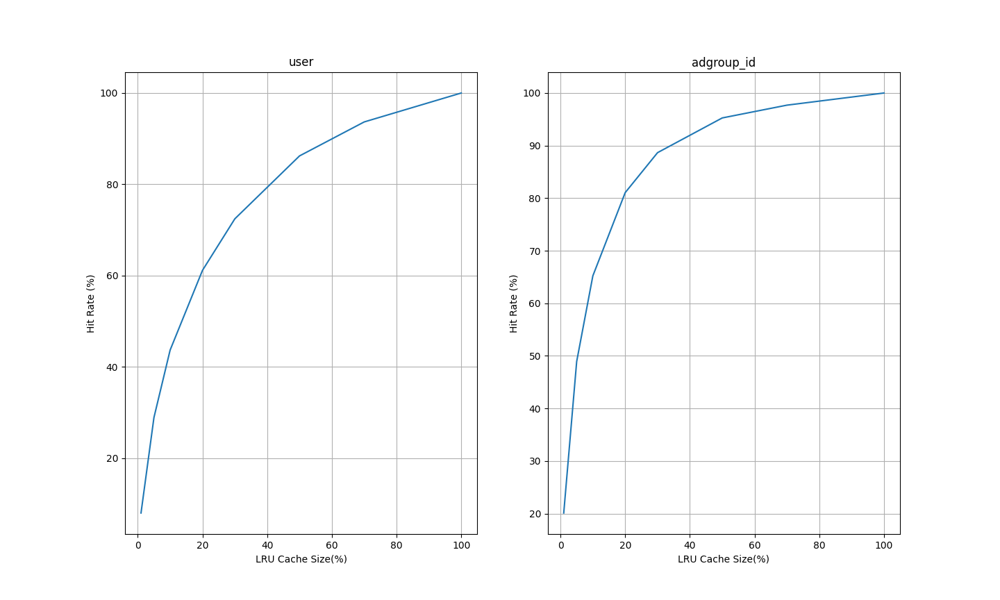

# DRAM-SSD 混合 embedding 存储 POC

## 结果记录

### logs说明

- inplace 目录中的是每次读写embedding文件都打开关闭一次，且原地读写
- filepool 目录中的是打开embedding文件，最后训练结束才关闭，且追加写
- compaction 目录中的是打开embedding文件，最后训练结束才关闭，且追加写，最后compaction
### 最新结果

数据说明：

- dsize：不同的id数目
- data size：每次迭代访问的id数量
- Cache Size：cache大小占dsize的比例
- Hit Rate：3次迭代总的命中率
- Epoch Zero：刚开始时内存中一个embedding都没有，所以先训练一轮，不计入命中率，这样可以先在内存中加载热数据
- Compaction：compaction使用的时间，这一步会读如所有dsize个不同id和他们的embedding到内存，然后重写emb.hdss和offset文件
- Total Time：程序执行的总时间

PS：磁盘使用量可以参考[LRU淘汰append写文件](#lru淘汰append写文件时写入embedding的数量与id的数量的比值只遍历一轮的比较)

#### User 数据

```
dsize = 1141729,
data size = 26557961
batch_size = 512
k_size = 4096
```

##### LRU

| Cache Size | Hit Rate | Epoch Zero | Train Time | Compaction | Total Time |
| ---------- | -------- | ---------- | ---------- | ---------- | ---------- |
| 100 %      | 100.00 % | 42.52 s    | 144.91 s   | 5.50 s     | 207.28 s   |
| 70 %       | 93.61 %  | 55.27 s    | 198.74 s   | 6.21 s     | 274.47 s   |
| 50 %       | 86.15 %  | 75.76 s    | 251.17 s   | 7.26 s     | 348.45 s   |
| 40 %       | 80.31 %  | 90.20 s    | 299.75 s   | 7.42 s     | 411.61 s   |
| 30 %       | 72.26 %  | 106.03 s   | 351.27 s   | 8.91 s     | 480.39 s   |
| 20 %       | 60.92 %  | 133.47 s   | 416.28 s   | 9.16 s     | 573.14 s   |
| 10 %       | 43.25 %  | 162.40 s   | 502.62 s   | 10.13 s    | 689.45 s   |

##### LFU

| Cache Size | Hit Rate | Epoch Zero | Train Time | Compaction | Total Time |
| ---------- | -------- | ---------- | ---------- | ---------- | ---------- |
| 100 %      | 100.00 % | 28.30 s    | 96.97 s    | 4.84 s     | 144.31 s   |
| 70 %       | 95.91 %  | 38.31 s    | 135.54 s   | 5.50 s     | 193.53 s   |
| 50 %       | 90.49 %  | 50.05 s    | 170.56 s   | 7.53 s     | 242.32 s   |
| 40 %       | 86.16 %  | 62.20 s    | 202.62 s   | 7.60 s     | 286.61 s   |
| 30 %       | 79.74 %  | 73.06 s    | 234.44 s   | 8.33 s     | 330.07 s   |
| 20 %       | 69.98 %  | 93.73 s    | 301.49 s   | 9.21 s     | 418.56 s   |
| 10 %       | 54.04 %  | 120.58 s   | 377.22 s   | 10.15 s    | 522.10 s   |
#### Adgroup 数据

```
dsize = 846811
data size = 26557961
batch_size = 512
k_size = 4096
```

##### LRU

| Cache Size | Hit Rate | Epoch Zero | Train Time | Compaction | Total Time |
| ---------- | -------- | ---------- | ---------- | ---------- | ---------- |
| 100 %      | 100.00 % | 30.57 s    | 108.29 s   | 3.50 s     | 157.98 s   |
| 70 %       | 97.67 %  | 34.03 s    | 126.01 s   | 4.27 s     | 179.90 s   |
| 50 %       | 95.21 %  | 39.66 s    | 144.57 s   | 5.12 s     | 204.93 s   |
| 30 %       | 88.51 %  | 55.95 s    | 191.20 s   | 5.97 s     | 268.59 s   |
| 20 %       | 80.78 %  | 70.44 s    | 252.88 s   | 6.74 s     | 345.56 s   |
| 10 %       | 64.62 %  | 123.28 s   | 394.44 s   | 7.62 s     | 540.89 s   |
| 5 %        | 47.76 %  | 140.04 s   | 437.22 s   | 8.22 s     | 601.44 s   |

##### LFU

| Cache Size | Hit Rate | Epoch Zero | Train Time | Compaction | Total Time |
| ---------- | -------- | ---------- | ---------- | ---------- | ---------- |
| 100 %      | 100.00 % | 24.16 s    | 89.75 s    | 3.67 s     | 133.12 s   |
| 70 %       | 98.53 %  | 26.44 s    | 103.72 s   | 4.01 s     | 149.72 s   |
| 50 %       | 97.08 %  | 31.43 s    | 117.13 s   | 4.73 s     | 168.75 s   |
| 30 %       | 92.33 %  | 42.76 s    | 150.30 s   | 6.12 s     | 214.69 s   |
| 20 %       | 86.44 %  | 52.98 s    | 185.75 s   | 6.20 s     | 260.47 s   |
| 10 %       | 73.58 %  | 73.48 s    | 243.54 s   | 6.96 s     | 339.38 s   |
| 5 %        | 59.25 %  | 95.53 s    | 311.11 s   | 7.94 s     | 430.12 s   |
## 测试数据

```
-pg
./main
gprof -b main gmon.out > report.txt
```

```
dataset/taobao/raw_sample.csv
userid size: 1141729
adgroupid size: 846811
total time: 88.99227023124695 s
```

### 统计信息

#### 数据分布


#### LRU缓存策略的表现



#### LFU缓存策略的表现


#### 缓存大小和LRU命中率的关系

当Cache能放下x%的id时，最频繁出现的前x%的id占所有迭代id的比例是q%，命中率是p%，则`Hit Rate Ratio`定义为p/q


#### 缓存大小和LFU命中率的关系


#### LRU与LFU命中率的比较


#### LRU淘汰append写文件时，写入embedding的数量与id的数量的比值（只遍历一轮）的比较


