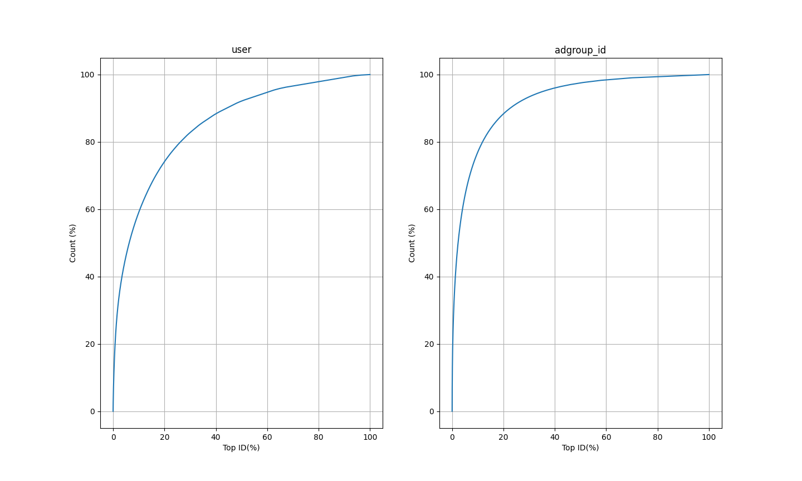
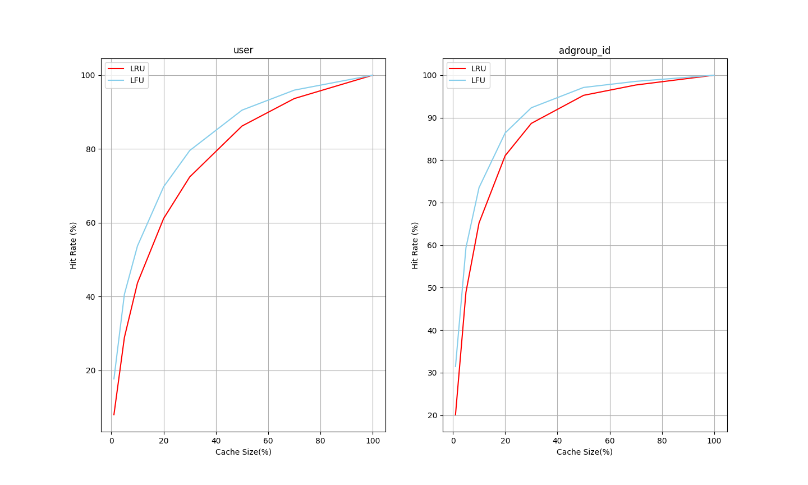

# DRAM-SSD 混合 embedding 存储 POC

## 存在的问题

1. 当前的 cache_manager 每 5 秒检查一次内存中实际存了的 embedding 数量，非常不准，系统中实际最多可以存放下的 embedding 数量远大于设定的值，导致缓存命中率计算错误
2. 多线程正确性

## 下一步

1. 用 embedding 池统一存储 embedding，管理内存使用
   train time 细粒度
2. 上一步完成后改进 cache 策略的实现和设计更好的 cache 策略
3. 正确使用多线程

## 测试数据

```
-pg
./main
gprof -b main gmon.out > report.txt
```

```
dataset/taobao/raw_sample.csv
userid size: 1141729
adgroupid size: 846811
total time: 88.99227023124695 s
```

### 统计信息

#### 数据分布



#### LRU缓存策略的表现


#### LFU缓存策略的表现


#### 缓存大小和LRU命中率的关系

当Cache能放下x%的id时，最频繁出现的前x%的id占所有迭代id的比例是q%，命中率是p%，则`Hit Rate Ratio`定义为p/q


#### 缓存大小和LFU命中率的关系


#### LRU与LFU命中率的比较



#### LRU淘汰append写文件时，写入embedding的数量与id的数量的比值（只遍历一轮）的比较


## 结果记录

### logs说明

- inplace 目录中的是每次读写embedding文件都打开关闭一次，且原地读写
- filepool 目录中的是打开embedding文件，最后训练结束才关闭，且追加写
- compaction 目录中的是打开embedding文件，最后训练结束才关闭，且追加写，最后compaction

### 最新结果

数据说明：

- dsize：不同的id数目
- data size：每次迭代访问的id数量
- max emb num：cache大小的embedding数量表示
- Cache Size：cache大小占dsize的比例
- Hit Rate：3次迭代总的命中率
- Epoch Zero：刚开始时内存中一个embedding都没有，所以先训练一轮，不计入命中率，这样可以先在内存中加载热数据
- Compaction：compaction使用的时间，这一步会读如所有dsize个不同id和他们的embedding到内存，然后重写emb.hdss和offset文件
- Total Time：程序执行的总时间

PS：磁盘使用量可以参考[LRU淘汰append写文件](#lru淘汰append写文件时写入embedding的数量与id的数量的比值只遍历一轮的比较)

#### User 数据

```
dsize = 1141729,
data size = 26557961
max emb num = 228345
batch_size = 512
k_size = 4096
```

| Cache Size | Hit Rate | Epoch Zero | Train Time | Compaction | Total Time |
| ---------- | -------- | ---------- | ---------- | ---------- | ---------- |
| 100 %      | 100.00 % | 39.44 s    | 129.56 s   | 4.74 s     | 187.99 s   |
| 70 %       | 93.62 %  | 54.43 s    | 193.57 s   | 5.58 s     | 268.09 s   |
| 50 %       | 86.14 %  | 70.06 s    | 246.22 s   | 6.73 s     | 337.23 s   |
| 40 %       | 80.31 %  | 86.53 s    | 289.14 s   | 7.30 s     | 397.19 s   |
| 30 %       | 72.27 %  | 102.79 s   | 333.36 s   | 8.03 s     | 458.58 s   |
| 20 %       | 60.93 %  | 125.75 s   | 410.10 s   | 9.04 s     | 559.12 s   |
| 10 %       | 43.28 %  | 156.40 s   | 505.57 s   | 10.16 s    | 686.34 s   |


#### Adgroup 数据

```
dsize = 846811
data size = 26557961
max emb num = 846811
batch_size = 512
k_size = 4096
```

| Cache Size | Hit Rate | Epoch Zero | Train Time | Compaction | Total Time |
| ---------- | -------- | ---------- | ---------- | ---------- | ---------- |
| 100 %      | 100.00 % | 29.07 s    | 109.05 s   | 3.96 s     | 155.95 s   |
| 70 %       | 97.67 %  | 33.88 s    | 131.98 s   | 4.02 s     | 183.72 s   |
| 50 %       | 95.21 %  | 61.76 s    | 215.09 s   | 4.94 s     | 296.35 s   |
| 30 %       | 88.51 %  | 66.32 s    | 218.03 s   | 5.79 s     | 306.40 s   |
| 20 %       | 80.79 %  | 74.80 s    | 269.00 s   | 6.24 s     | 363.99 s   |
| 10%        | 64.63 %  | 101.64 s   | 331.31 s   | 7.14 s     | 453.95 s   |

