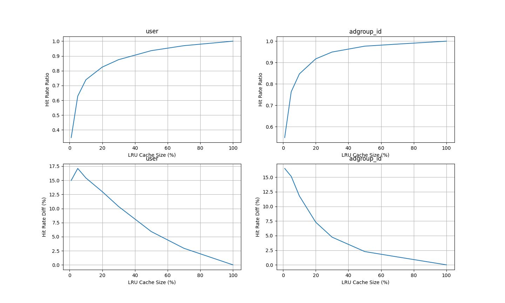

# DRAM-SSD 混合 embedding 存储 POC

## 结果记录

### logs说明

- inplace 目录中的是每次读写embedding文件都打开关闭一次，且原地读写
- filepool 目录中的是打开embedding文件，最后训练结束才关闭，且追加写
- compaction 目录中的是打开embedding文件，最后训练结束才关闭，且追加写，最后compaction
### 最新结果

数据说明：

- dsize：不同的id数目
- data size：每次迭代访问的id数量
- Cache Size：cache大小占dsize的比例
- Hit Rate：3次迭代总的命中率
- Epoch Zero：刚开始时内存中一个embedding都没有，所以先训练一轮，不计入命中率，这样可以先在内存中加载热数据
- Compaction：compaction使用的时间，这一步会读如所有dsize个不同id和他们的embedding到内存，然后重写emb.hdss和offset文件
- Total Time：程序执行的总时间

PS：磁盘使用量可以参考[LRU淘汰append写文件](#lru淘汰append写文件时写入embedding的数量与id的数量的比值只遍历一轮的比较)

#### User 数据

```
dsize = 1141729,
data size = 26557961
batch_size = 512
k_size = 4096
```

##### LRU

| Cache Size | Hit Rate | Epoch Zero | Train Time | Compaction | Total Time |
| ---------- | -------- | ---------- | ---------- | ---------- | ---------- |
| 100 %      | 100.00 % | 41.24 s    | 110.08 s   | 4.01 s     | 169.56 s   |
| 70 %       | 93.61 %  | 54.19 s    | 166.32 s   | 5.33 s     | 240.14 s   |
| 50 %       | 86.15 %  | 72.15 s    | 219.94 s   | 6.38 s     | 312.78 s   |
| 40 %       | 80.31 %  | 84.20 s    | 252.42 s   | 6.84 s     | 357.70 s   |
| 30 %       | 72.26 %  | 99.64 s    | 303.87 s   | 7.51 s     | 425.29 s   |
| 20 %       | 60.93 %  | 122.06 s   | 367.13 s   | 8.57 s     | 512.07 s   |
| 10 %       | 43.29 %  | 148.63 s   | 443.76 s   | 9.69 s     | 616.37 s   |

##### LFU

| Cache Size | Hit Rate | Epoch Zero | Train Time | Compaction | Total Time |
| ---------- | -------- | ---------- | ---------- | ---------- | ---------- |
| 100 %      | 100.00 % | 28.60 s    | 72.96 s    | 4.46 s     | 120.33 s   |
| 70 %       | 95.91 %  | 41.99 s    | 121.39 s   | 5.59 s     | 184.39 s   |
| 50 %       | 90.49 %  | 53.56 s    | 154.99 s   | 6.53 s     | 230.22 s   |
| 40 %       | 86.16 %  | 63.94 s    | 179.76 s   | 6.84 s     | 265.10 s   |
| 30 %       | 79.74 %  | 69.36 s    | 203.40 s   | 7.58 s     | 294.77 s   |
| 20 %       | 69.99 %  | 85.33 s    | 252.34 s   | 8.29 s     | 360.30 s   |
| 10 %       | 54.06 %  | 109.22 s   | 325.16 s   | 8.86 s     | 457.52 s   |
#### Adgroup 数据

```
dsize = 846811
data size = 26557961
batch_size = 512
k_size = 4096
```

##### LRU

| Cache Size | Hit Rate | Epoch Zero | Train Time | Compaction | Total Time |
| ---------- | -------- | ---------- | ---------- | ---------- | ---------- |
| 100 %      | 100.00 % | 31.32 s    | 83.41 s    | 2.60 s     | 132.92 s   |
| 70 %       | 97.67 %  | 33.39 s    | 101.43 s   | 3.43 s     | 153.83 s   |
| 50 %       | 95.21 %  | 38.92 s    | 117.62 s   | 4.10 s     | 176.13 s   |
| 30 %       | 88.51 %  | 54.68 s    | 163.00 s   | 5.00 s     | 238.26 s   |
| 20 %       | 80.79 %  | 69.23 s    | 208.52 s   | 5.54 s     | 298.84 s   |
| 10 %       | 64.66 %  | 97.74 s    | 320.27 s   | 6.96 s     | 440.57 s   |
| 5 %        | 47.87 %  | 130.49 s   | 370.03 s   | 7.59 s     | 523.83 s   |

##### LFU

| Cache Size | Hit Rate | Epoch Zero | Train Time | Compaction | Total Time |
| ---------- | -------- | ---------- | ---------- | ---------- | ---------- |
| 100 %      | 100.00 % | 24.06 s    | 63.91 s    | 3.30 s     | 106.81 s   |
| 70 %       | 98.53 %  | 26.06 s    | 77.48 s    | 4.27 s     | 123.33 s   |
| 50 %       | 97.08 %  | 30.75 s    | 91.97 s    | 4.84 s     | 143.01 s   |
| 30 %       | 92.33 %  | 41.90 s    | 122.09 s   | 5.23 s     | 184.84 s   |
| 20 %       | 86.45 %  | 51.30 s    | 153.91 s   | 5.64 s     | 226.39 s   |
| 10 %       | 73.61 %  | 70.45 s    | 220.78 s   | 7.00 s     | 313.80 s   |
| 5 %        | 59.33 %  | 92.82 s    | 289.91 s   | 7.80 s     | 406.19 s   |
## 测试数据

```
-pg
./main
gprof -b main gmon.out > report.txt
```

```
dataset/taobao/raw_sample.csv
userid size: 1141729
adgroupid size: 846811
total time: 88.99227023124695 s
```

### 统计信息

#### 数据分布


#### LRU缓存策略的表现


#### LFU缓存策略的表现


#### 缓存大小和LRU命中率的关系

当Cache能放下x%的id时，最频繁出现的前x%的id占所有迭代id的比例是q%，命中率是p%，则`Hit Rate Ratio`定义为p/q



#### 缓存大小和LFU命中率的关系


#### LRU与LFU命中率的比较


#### LRU淘汰append写文件时，写入embedding的数量与id的数量的比值（只遍历一轮）的比较


#### LFU淘汰append写文件时，写入embedding的数量与id的数量的比值（只遍历一轮）的比较


