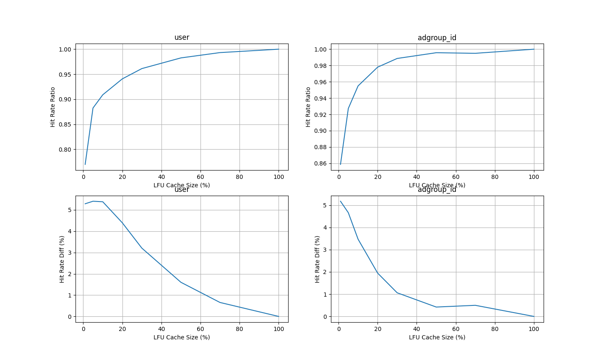

# DRAM-SSD 混合 embedding 存储 POC

## 存在的问题

1. 当前的 cache_manager 每 5 秒检查一次内存中实际存了的 embedding 数量，非常不准，系统中实际最多可以存放下的 embedding 数量远大于设定的值，导致缓存命中率计算错误
2. 多线程正确性

## 下一步

1. 用 embedding 池统一存储 embedding，管理内存使用
   train time 细粒度
2. 上一步完成后改进 cache 策略的实现和设计更好的 cache 策略
3. 正确使用多线程

## 测试数据

```
-pg
./main
gprof -b main gmon.out > report.txt
```

```
dataset/taobao/raw_sample.csv
userid size: 1141729
adgroupid size: 846811
total time: 88.99227023124695 s
```

### 统计信息

#### 数据分布


#### LRU缓存策略的表现


#### LFU缓存策略的表现


#### 缓存大小和LRU命中率的关系

当Cache能放下x%的id时，最频繁出现的前x%的id占所有迭代id的比例是q%，命中率是p%，则`Hit Rate Ratio`定义为p/q


#### 缓存大小和LFU命中率的关系



#### LRU与LFU命中率的比较


## 结果记录（commit 796dd7c2d0fb8202b522969588273a4428ad371d）

总共有 1141729 个不同的 userid 或 846811 个不同的 adgroupid，每一轮迭代进行 26557961 次访问。

### 内存中最多放 409600（总量的 36%） 个 embedding 且采用 LRU 时，使用 userid 数据

```
[INFO]: hdss/main.cpp:186 (main): read id time = 22.86 s
[INFO]: hdss/main.cpp:187 (main): train time = 692.56 s
[INFO]: hdss/main.cpp:188 (main): save time = 12.24 s
[INFO]: hdss/main.cpp:189 (main): total time = 729.19 s
[INFO]: hdss/main.cpp:191 (main): total hit rate = 79.99 %
```

### 内存中最多放 409600（总量的 48%） 个 embedding 且采用 LRU 时，使用 adgroupid 数据

```
[INFO]: hdss/main.cpp:186 (main):  	read id time = 24.30 s
[INFO]: hdss/main.cpp:187 (main):  	train time = 88.40 s
[INFO]: hdss/main.cpp:188 (main):  	save time = 8.32 s
[INFO]: hdss/main.cpp:189 (main):  	total time = 125.12 s
[INFO]: hdss/main.cpp:191 (main):  	total hit rate = 96.81 %
```

### 内存中最多放 84681（总量的 10%） 个 embedding 且采用 LRU 时，使用 adgroupid 数据

```
[INFO]: hdss/main.cpp:186 (main):  	read id time = 29.08 s
[INFO]: hdss/main.cpp:187 (main):  	train time = 97.19 s
[INFO]: hdss/main.cpp:188 (main):  	save time = 4.94 s
[INFO]: hdss/main.cpp:189 (main):  	total time = 134.88 s
[INFO]: hdss/main.cpp:191 (main):  	total hit rate = 96.81 %
```

## 结果记录（commit 52341659b61bafd52c3d56f62c8ce7741e59c46b)

见logs目录